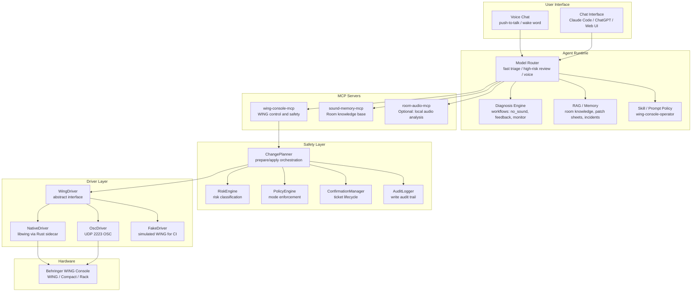
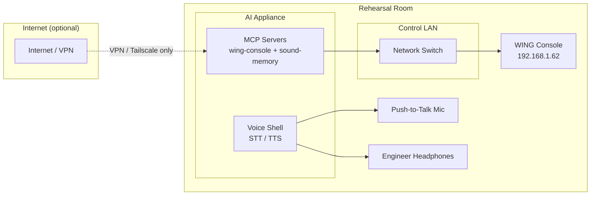

# Architecture Overview

> WING AI Sound Engineer -- System Architecture
> Version 0.1.0 | 2026-05-12

---

## Table of Contents

1. [System Diagram](#1-system-diagram)
2. [Component Descriptions](#2-component-descriptions)
3. [Data Flow: Reads](#3-data-flow-reads)
4. [Data Flow: Writes](#4-data-flow-writes)
5. [Safety Engine Design](#5-safety-engine-design)
6. [Multi-Level View Design](#6-multi-level-view-design)
7. [Protocol Layering](#7-protocol-layering)
8. [Driver Architecture](#8-driver-architecture)
9. [State Management](#9-state-management)
10. [Diagnosis Engine Design](#10-diagnosis-engine-design)
11. [Memory and RAG Architecture](#11-memory-and-rag-architecture)
12. [Voice Shell Architecture](#12-voice-shell-architecture)
13. [Deployment Architecture](#13-deployment-architecture)
14. [Module Inventory](#14-module-inventory)

---

## 1. System Diagram



### Network Topology



---

## 2. Component Descriptions

### 2.1 Agent Runtime

The agent runtime orchestrates the AI's behavior. It is NOT the MCP server itself -- it is the client that calls MCP tools.

| Module | Responsibility |
|--------|---------------|
| **Model Router** | Routes tasks to appropriate models: fast triage (e.g., DeepSeek Flash) for simple queries, strong reasoning for high-risk review, low-latency for voice |
| **Diagnosis Engine** | Structured state machine for sound problems (`no_sound`, `feedback`, `monitor_mix`, `recording_no_signal`, `livestream_no_signal`) |
| **RAG / Memory** | Loads room context: patch sheets, band preferences, incident history, equipment inventory |
| **Skill / Prompt Policy** | Loads `wing-console-operator` skill to teach the model safe WING operations |

### 2.2 MCP Servers

Three MCP servers (can be deployed as one monolith initially):

| Server | Protocol | Purpose |
|--------|----------|---------|
| **wing-console-mcp** | stdio / Streamable HTTP | Full WING control: parameters, channels, routing, meters, scenes, processing |
| **sound-memory-mcp** | stdio / HTTP | Room knowledge: patch sheets, band preferences, incident history, semantic search |
| **room-audio-mcp** | stdio / HTTP | Optional: local mic capture, SPL measurement, RTA, feedback detection |

### 2.3 Safety Layer

All write operations pass through the safety layer. This is enforced server-side, not in prompts.

| Component | File | Function |
|-----------|------|----------|
| **RiskEngine** | `safety/RiskEngine.ts` | Classifies every tool+target combination into `none/low/medium/high/critical` |
| **PolicyEngine** | `safety/PolicyEngine.ts` | Enforces mode restrictions, delta caps, live mode rules |
| **ConfirmationManager** | `safety/ConfirmationManager.ts` | Creates, validates, expires confirmation tickets (5 min TTL) |
| **AuditLogger** | `safety/AuditLogger.ts` | Records every write attempt with old/new/readback values |
| **ChangePlanner** | `safety/ChangePlanner.ts` | Orchestrates the full 13-step write protocol |

### 2.4 Driver Layer

Abstracts WING communication protocols behind a unified interface.

| Driver | Kind | Protocol | Port | Use Case |
|--------|------|----------|------|----------|
| **NativeDriver** | `native` | Native binary protocol via Rust sidecar | TCP/UDP 2222 | Primary: full parameter tree, meters, events |
| **OscDriver** | `osc` | Open Sound Control | UDP 2223 | Fallback: basic get/set, interop |
| **FakeWingDriver** | `fake` | In-memory simulation | none | CI testing, development, demos |

---

## 3. Data Flow: Reads

Read operations are direct and synchronous through the driver:

```
User/Agent asks: "What is the fader level for CH 1?"
    |
    v
MCP Tool: wing_channel_get({ channel: 1 })
    |
    v
StateCache.check("/ch/1/fader")  <-- cache hit? return immediately
    | (cache miss)
    v
WingDriver.getParam("/ch/1/fader")
    |
    +-- NativeDriver: JSON-RPC to Rust sidecar -> libwing -> WING
    +-- OscDriver:    UDP /ch/1/fdr -> WING, parse response
    +-- FakeDriver:   Map.get("/ch/1/fader") -> return simulated value
    |
    v
StateCache.set("/ch/1/fader", value)    <-- cache for TTL ms
    |
    v
Return ToolResult {
  ok: true,
  data: { channel: 1, fader: -6.0, ... },
  human_summary: "CH 1 (Vocal 1): Fader -6.0 dB"
}
```

### Bulk Read Optimization

For large reads (e.g., listing all 48 channels), the system uses:

1. **wing_param_bulk_get**: Reads an array of paths or an entire node prefix in one driver call
2. **wing_state_summary**: Returns only semantically meaningful data (named channels, anomalies)
3. **wing_state_snapshot**: Full dump when needed, but large -- use sparingly

The multi-level view tools prevent the model from calling 100 individual reads.

---

## 4. Data Flow: Writes

Every write follows a 13-step protocol enforced by `ChangePlanner`:

```
User/Agent: "Raise vocal 1 by 3 dB"
    |
    v
MCP Tool: wing_channel_adjust_fader_prepare({
    channel: 1, delta_db: 3, reason: "..."
})
    |
    v
ChangePlanner.prepareWrite(...)
    |
    +-- 1. resolve target: "/ch/1/fader"
    +-- 2. WingDriver.getParam("/ch/1/fader") -> oldValue: -9.0 dB
    +-- 3. RiskEngine.classify(tool, target) -> "medium"
    +-- 4. PolicyEngine.decide({ risk: "medium", mode: "rehearsal_safe", ... })
    |       +-- Check mode: rehearsal_safe allows medium [OK]
    |       +-- Check delta cap: 3.0 dB <= 3.0 dB [OK]
    |       +-- Decision: ALLOWED, requires confirmation
    +-- 5. generate plan: old: -9.0 -> new: -6.0
    +-- 6. ConfirmationManager.createTicket(...) -> confirmation_id: "chg_abc123"
    |
    v
Return to agent: {
  ok: true,
  data: { confirmationId: "chg_abc123", risk: "medium", ... },
  human_summary: "Current: -9.0 dB -> Target: -6.0 dB. Confirm: chg_abc123"
}
    |
    v
Agent asks user for confirmation -> User confirms
    |
    v
MCP Tool: wing_channel_adjust_fader_apply({
    channel: 1, delta_db: 3, confirmation_id: "chg_abc123"
})
    |
    v
ChangePlanner.applyWrite(...)
    |
    +-- 7. ConfirmationManager.validateTicket("chg_abc123", tool, target)
    |       +-- Ticket exists [OK]
    |       +-- Not expired (5 min TTL) [OK]
    |       +-- Tool matches [OK]
    |       +-- Target matches [OK]
    +-- 8. WingDriver.getParam("/ch/1/fader") -> re-read: still -9.0 [unchanged]
    +-- 9. PolicyEngine.decide(...) -> still allowed [OK]
    +-- 10. WingDriver.setParam("/ch/1/fader", { type: "float", value: -6.0, unit: "dB" })
    +-- 11. WingDriver.getParam("/ch/1/fader") -> readback: -6.0
    +-- 12. Compare: expected -6.0 == readback -6.0 [OK]
    +-- 13. AuditLogger.log({ result: "success", ... })
    +-- 14. ConfirmationManager.consumeTicket("chg_abc123")
    |
    v
Return to agent: {
  ok: true,
  data: {
    oldValue: -9.0, requestedValue: -6.0,
    readbackValue: -6.0, auditId: "aud_xyz"
  },
  human_summary: "Completed: /ch/1/fader -9.0 dB -> -6.0 dB. Readback: -6.0 dB. Audit: aud_xyz"
}
```

### Denied Write Flow

```
ChangePlanner.prepareWrite(...)
    |
    +-- PolicyEngine.decide(...) -> NOT ALLOWED
    |       Reason: "critical risk in rehearsal_safe mode"
    +-- AuditLogger.log({ result: "denied", ... })
    |
    v
Return: {
  ok: false,
  errors: [{ code: "POLICY_DENIED", message: "critical risk in rehearsal_safe mode" }],
  human_summary: "Action denied: critical risk exceeds rehearsal_safe maximum. Switch to maintenance mode."
}
```

---

## 5. Safety Engine Design

### 5.1 Risk Classification

`RiskEngine.classify(tool, target)` uses a two-layer approach:

**Layer 1: Tool-based risk map** (`types.ts` `RISK_MAP`)
- Every tool has a base risk level defined statically
- Read-only tools: `none`
- Channel fader/mute: `medium`
- Main fader/DCA: `high`
- Phantom/routing/raw: `critical`

**Layer 2: Target-based elevation**
- If the target path contains `/phantom/` -> elevate to `critical`
- If the target path contains `/routing/` or `/route/` -> elevate to `critical`
- If the target path contains `/main/lr/` -> elevate to `high`
- If the target contains `scene` or `snapshot` -> elevate to `critical`

### 5.2 Policy Decision Matrix

| Mode | none risk | low | medium | high | critical | Raw tools |
|------|-----------|-----|--------|------|----------|-----------|
| `read_only` | ALLOW | DENY | DENY | DENY | DENY | DENY |
| `rehearsal_safe` | ALLOW | ALLOW | ALLOW* | DENY | DENY | DENY |
| `maintenance` | ALLOW | ALLOW | ALLOW* | ALLOW* | ALLOW* | DENY (unless enabled) |
| `developer_raw` | ALLOW | ALLOW | ALLOW* | ALLOW* | ALLOW* | ALLOW* |

\* Requires confirmation.

### 5.3 Delta Caps

`PolicyEngine` enforces maximum change magnitudes in non-developer modes:

```
channel_fader_db:    3.0   // Channel fader max 3 dB per adjustment
send_db:             6.0   // Send level max 6 dB per adjustment
main_fader_db:       1.5   // Main LR fader max 1.5 dB per adjustment
eq_gain_db:          3.0   // EQ gain max 3 dB per adjustment
gate_threshold_db:   6.0   // Gate threshold max 6 dB per adjustment
```

### 5.4 Confirmation Ticket Lifecycle

```
CREATE -> PENDING -> VALIDATED -> CONSUMED
  |          |           |
  |          |           +-- Validation fails -> REJECTED
  |          |
  |          +-- 5 min TTL expires -> EXPIRED (cleaned up)
  |
  +-- Tool/target mismatch -> REJECTED
```

- Tickets expire after 5 minutes
- A ticket created for tool A/target X cannot be used for tool B/target Y
- If the underlying value changes between prepare and apply, the system re-reads and computes delta from the new value
- Cleanup runs on validation to remove expired tickets

### 5.5 Audit Record

Every write attempt produces an immutable audit record:

```
id: UUID
timestamp: ISO 8601
session_id: string
operator_id: string (optional)
mode: "read_only" | "rehearsal_safe" | "maintenance" | "developer_raw"
risk: "none" | "low" | "medium" | "high" | "critical"
tool: MCP tool name
target: canonical parameter path
reason: why the change was made
old_value: state before write
requested_value: what was requested
readback_value: what was actually set
confirmation_text: optional
result: "success" | "denied" | "failed" | "readback_mismatch"
driver: "native" | "osc" | "wapi" | "fake"
```

### 5.6 Absolute Denials (Server-Level)

The server denies these regardless of model prompt:
- Raw protocol command in live mode
- Critical action without exact confirmation
- Reusing expired confirmation_id
- Applying a confirmation_id generated for another target
- Applying when old state has changed materially since prepare
- Writing network settings unless explicitly enabled in maintenance config
- Applying scene recall while active diagnosis session is unresolved (unless admin override)

---

## 6. Multi-Level View Design

To prevent the model from making hundreds of individual `getParam` calls, the system provides four view levels:

```
Level 1: wing_quick_check        <- "any problems?"      1-line verdict
Level 2: wing_state_summary      <- "what's going on?"   overview by section
Level 3: wing_state_snapshot     <- "give me everything"  full dump (use sparingly)
Level 4: wing_channel_strip      <- "tell me about CH X"  deep dive on one target
Tracer:  wing_signal_path_trace  <- "follow the signal"   end-to-end path
```

### Design Principle

```
AI should never have to guess how to read the mixer.
Each level provides exactly the right amount of detail for the task.
```

### Level Selection Guide

| Task | Best View | Why |
|------|-----------|-----|
| "Any problems?" | `quick_check` | Fast, highlights anomalies |
| "What's muted?" | `state_summary` | Lists channels with mute/fader |
| "Deep diagnosis" | `state_snapshot` | Complete state for pattern analysis |
| "Check CH 1 EQ" | `channel_strip` | All processing for one channel |
| "No sound on CH 1" | `signal_path_trace` | Follows signal end-to-end |
| "Line check" | `quick_check` then `state_summary` | Fast scan then detailed report |

---

## 7. Protocol Layering

```
+----------------------------------------------------------+
|  MCP Tools (high-level semantic)                         |
|  wing_channel_adjust_fader, wing_send_get,               |
|  wing_routing_trace, sound_diagnosis_start, ...          |
|                                                          |
|  -> Model calls these.                                   |
|  -> Each tool has clear "Use this when..." description.   |
|  -> Risk level and confirmation policy are pre-defined.   |
+---------------------------+------------------------------+
                            |
+---------------------------v------------------------------+
|  ChangePlanner (write orchestration)                     |
|                                                          |
|  prepareWrite() -> risk check -> policy check -> ticket   |
|  applyWrite()   -> validate ticket -> re-read -> write    |
|                  -> readback -> compare -> audit          |
+---------------------------+------------------------------+
                            |
+---------------------------v------------------------------+
|  PolicyEngine (mode enforcement)                         |
|                                                          |
|  - Mode gates: read_only, rehearsal_safe, maintenance    |
|  - Delta caps: channel 3dB, send 6dB, main 1.5dB        |
|  - Live mode: deny raw tools                             |
|  - Rate limits: max 12 writes/min                        |
+---------------------------+------------------------------+
                            |
+---------------------------v------------------------------+
|  WingDriver (abstract interface)                         |
|                                                          |
|  getParam(path) -> WingValue                             |
|  setParam(path, value) -> void                           |
|  getNode(prefix) -> Record<string, WingValue>            |
|  meterRead(targets, windowMs) -> MeterFrame              |
+---------------------------+------------------------------+
                            |
        +-------------------+-------------------+
        |                   |                   |
        v                   v                   v
+----------------+ +----------------+ +----------------+
| NativeDriver   | | OscDriver      | | FakeDriver     |
|                | |                | |                |
| JSON-RPC ->    | | UDP 2223       | | In-memory      |
| Rust sidecar   | | OSC codec      | | Map<string,    |
| -> libwing     | |                | | WingValue>     |
+-------+--------+ +-------+--------+ +----------------+
        |                  |
        v                  v
+----------------------------------------------------------+
|          Behringer WING Console                          |
|    TCP/UDP 2222 (Native)                                 |
|    UDP 2223 (OSC)                                        |
+----------------------------------------------------------+
```

### Canonical Path Abstraction

All upper layers use canonical paths. Drivers translate to protocol-specific formats:

```
Upper layers:     /ch/1/mute     /ch/1/fader    /headamp/local/1/phantom

NativeDriver:     native node ID + token          (via libwing)
OscDriver:        /ch/1/mute, int                 (UDP 2223)
FakeDriver:       Map.get("/ch/1/mute")           (in-memory)
```

This allows swapping drivers without changing any upper-layer code.

---

## 8. Driver Architecture

### WingDriver Interface

```typescript
interface WingDriver {
  kind: DriverKind;  // "native" | "osc" | "wapi" | "fake"

  discover(options: {
    timeoutMs: number;
    directIps?: string[];
  }): Promise<WingDevice[]>;

  connect(device: WingDevice): Promise<void>;
  disconnect(): Promise<void>;
  getInfo(): Promise<WingDevice>;

  getParam(path: string): Promise<WingValue>;
  setParam(path: string, value: WingValue): Promise<void>;
  getNode(path: string): Promise<Record<string, WingValue>>;
  setNode(path: string, patch: Record<string, WingValue>): Promise<void>;

  meterRead(targets: string[], windowMs: number): Promise<MeterFrame>;
}
```

### Driver Selection Strategy

```typescript
function chooseDriver(capability: Capability, config: RuntimeConfig): DriverKind {
  if (config.forceDriver) return config.forceDriver;
  if (capability.requiresMeterStream) return "native";
  if (capability.requiresFullSchema) return "native";
  if (capability.isRawOscDeveloperMode) return "osc";
  if (config.nativeAvailable) return "native";
  if (config.oscFallbackEnabled) return "osc";
  throw new Error("No suitable WING driver available");
}
```

### Native Driver (Rust Sidecar)

```
TypeScript MCP Server
    |
    | JSON-RPC over stdio
    v
Rust wing-native-sidecar
    |
    | libwing / Native protocol
    v
WING console (TCP/UDP 2222)
```

Sidecar API:
```json
{"method":"discover","params":{}}
{"method":"connect","params":{"ip":"192.168.1.62"}}
{"method":"get_param","params":{"path":"/ch/1/mute"}}
{"method":"set_param","params":{"path":"/ch/1/mute","value":true}}
{"method":"meter_subscribe","params":{"paths":["/ch/1/in","/main/l"]}}
```

### FakeWingDriver (Development/CI)

The `FakeWingDriver` simulates a complete WING console:
- 48 channels with full parameter trees (EQ, gate, comp, sends)
- 16 buses with mute/fader/name
- 8 DCA groups, 6 mute groups, 8 matrix outputs
- 8 FX slots with model names
- 48 headamp inputs with gain and phantom
- Main LR with mute/fader
- Scene management
- USB recorder status
- Meter simulation
- **Fault injection**: configurable timeout, disconnect, readback mismatch probabilities

---

## 9. State Management

### StateCache

Provides TTL-based caching to reduce redundant driver reads:

```typescript
class StateCache {
  private cache: Map<string, { value: WingValue; ts: number }>;
  private ttlMs: number;  // default 5000ms

  get(path: string): WingValue | undefined;
  set(path: string, value: WingValue): void;
  invalidate(path: string): void;
  invalidateByPrefix(prefix: string): void;
  clear(): void;
}
```

- Cache is invalidated on any write to the same prefix
- Default TTL is 5 seconds
- Cache is per-session, not shared across connections

### AliasResolver

Maps human-friendly names to canonical paths:

```typescript
class AliasResolver {
  resolve("main fader") -> "/main/lr/fader"
  resolve("main mute")  -> "/main/lr/mute"
  search("channel")      -> ["/ch/1/mute", "/ch/1/fader", ...]
}
```

### UnitConverter

Handles dB-linear conversions:

```typescript
UnitConverter.dbToLinear(-6)  -> 0.501
UnitConverter.linearToDb(0.5) -> -6.02
```

---

## 10. Diagnosis Engine Design

### State Machine

```
idle -> scoping -> signal_check -> breakpoint_classify -> recommend
                                                             |
                                                      fix_prepare
                                                             |
                                                       fix_apply
                                                             |
                                                         verify
                                                             |
                                                         closed
```

### Workflows

| Workflow | Breakpoints (checked in order) |
|----------|-------------------------------|
| `no_sound` | source -> input_patch -> channel -> bus_send -> bus_main -> output |
| `feedback` | monitor_level -> mic_placement -> eq_ringing -> gain_staging |
| `monitor_mix` | send_level -> bus_routing -> bus_mute -> pre_post |
| `recording_no_signal` | source -> channel -> usb_send -> recorder_armed -> file_path |
| `livestream_no_signal` | source -> channel -> matrix_send -> matrix_output -> stream_dest |

### Hypothesis Scoring

```
score = information_gain
      - risk_penalty
      - user_effort_penalty
      - time_penalty
      + reversibility_bonus
      + telemetry_confidence_bonus
```

### Breakpoint Rules (No-Sound Example)

```typescript
// No input meter -> problem is upstream
if (!inputMeter.present) {
  hypotheses = [
    { label: "source_or_cable", probability: 0.45 },
    { label: "input_patch", probability: 0.25 },
    { label: "headamp_or_phantom", probability: 0.20 },
    { label: "stagebox_or_network", probability: 0.10 }
  ];
}

// Input present but no post-fader -> problem is in channel
if (inputMeter.present && !postFaderMeter.present) {
  if (channel.mute) hypothesis("channel_muted", 0.85);
  if (channel.fader_db <= -80) hypothesis("channel_fader_down", 0.75);
  if (gate.closed) hypothesis("gate_closed", 0.70);
}

// Post-fader present but no main -> between channel and main
if (postFaderMeter.present && !mainMeter.present) {
  hypotheses = [
    { label: "main_send_disabled", probability: 0.50 },
    { label: "dca_or_mute_group", probability: 0.25 },
    { label: "routing", probability: 0.25 }
  ];
}

// Main has signal but no room sound -> external problem
if (mainMeter.present && !humanReportsRoomSound) {
  hypotheses = [
    { label: "output_patch", probability: 0.35 },
    { label: "speaker_processor_or_amp", probability: 0.45 },
    { label: "powered_speaker_or_cable", probability: 0.20 }
  ];
}
```

---

## 11. Memory and RAG Architecture

### Memory Types

| Type | Example | Write Policy |
|------|---------|-------------|
| **semantic** | "Room A main speakers on XLR 7/8" | Confirmed or documented |
| **episodic** | "CH 7 cable failed on 2026-05-10" | Tool/user observed |
| **procedural** | "No-sound diagnosis order" | Maintained in repo |
| **preference** | "Drummer wants click +4 dB in IEM" | User confirmation required |
| **safety** | "AI cannot control Main LR in Room B" | Admin only |
| **operational** | "Diagnosing Vocal 1 no sound" | Automatic, TTL |

### Search Ranking

```
score = semantic_similarity
      + scope_boost(room/band/device)
      + recency_boost(incidents)
      + confidence_boost
      + source_quality_boost
      - stale_penalty
```

### RAG Response Rule

When using memory in diagnosis, the model must distinguish sources:

```
- live telemetry says ...   (current WING meter/data)
- room memory says ...      (stored knowledge)
- user just reported ...    (what you just said)
- I infer ...               (AI's reasoning)
```

Live telemetry always takes precedence over stale memory.

### Storage

| Environment | Metadata/Audit | Vector Search | Documents |
|-------------|---------------|---------------|-----------|
| Development | SQLite | sqlite-vss / LanceDB | Markdown/YAML files |
| Production | PostgreSQL | pgvector / Qdrant | Object storage |

---

## 12. Voice Shell Architecture

```
+------------------------------------------+
|              Voice Shell                  |
|                                           |
|  Input Pipeline:                          |
|    Push-to-Talk -> VAD -> STT -> Text Agent |
|                                           |
|  Output Pipeline:                         |
|    Text Agent -> TTS -> Safe Playback      |
|                     -> Engineer Headphones |
|                     -> NOT Main LR/PA      |
|                                           |
|  Session Management:                      |
|    Turn Manager -> Interruption Handler    |
|    -> Transcript Logger                    |
+------------------------------------------+
```

### Audio Path Safety

```
TTS output -> Engineer headphones / small local speaker
          -> NEVER routed to Main LR
          -> NEVER routed to musician monitors
```

### Provider Abstraction

```
openaiRealtime.ts  -> OpenAI Realtime API
localWhisper.ts    -> Local Whisper / faster-whisper
deepseekText.ts    -> DeepSeek chat completions
```

---

## 13. Deployment Architecture

### Rehearsal Room Appliance

```
Hardware:
  - Mini PC / Mac mini / NUC
  - Wired Ethernet to WING control LAN (NIC 1)
  - Optional second NIC for internet (NIC 2)
  - USB audio interface for voice mic + engineer headphones
  - Push-to-talk microphone
  - Optional touchscreen / iPad Web UI

Software (systemd services):
  - wing-console-mcp.service
  - sound-memory-mcp.service
  - room-audio-mcp.service (optional)
  - voice-shell.service
  - operator-console.service (optional)
```

### Configuration

```yaml
# /etc/ai-sound-engineer/config.yaml
room_id: room-a
mode: rehearsal_safe

wing:
  discovery:
    enabled: true
    direct_ips: ["192.168.1.62"]
  preferred_driver: native
  osc_fallback: true

safety:
  live_mode: true
  require_confirmation_for: [medium, high, critical]

voice:
  input: push_to_talk
  tts_output: local_speaker

memory:
  sqlite_path: /var/lib/ai-sound-engineer/memory.sqlite
  docs_path: /var/lib/ai-sound-engineer/docs
```

---

## 14. Module Inventory

### TypeScript (packages/wing-console-mcp)

```
src/
+-- server.ts              MCP server registration + transport setup
+-- types.ts               Shared types, Zod schemas, RISK_MAP
+-- tools/
|   +-- device.ts          wing_discover, wing_connect, wing_get_status
|   +-- schema.ts          wing_schema_search, wing_param_resolve
|   +-- params.ts          wing_param_get, wing_param_set_prepare/apply
|   +-- channels.ts        wing_channel_*
|   +-- sends.ts           wing_send_*
|   +-- routing.ts         wing_routing_*
|   +-- headamp.ts         wing_headamp_*, wing_phantom_*
|   +-- scenes.ts          wing_scene_*, wing_snapshot_*
|   +-- meters.ts          wing_meter_*, wing_signal_check
|   +-- diagnosis.ts       sound_diagnosis_*
|   +-- views.ts           wing_quick_check, wing_state_summary/snapshot,
|   |                      wing_channel_strip, wing_signal_path_trace
|   +-- processing.ts      wing_eq_*, wing_gate_*, wing_comp_*, wing_fx_*
|   +-- groups.ts          wing_dca_*, wing_mute_group_*, wing_main_*, wing_matrix_*
|   +-- bulk.ts            wing_param_bulk_get, wing_debug_dump_state,
|   |                      wing_usb_recorder_*
|   +-- raw.ts             wing_raw_osc_*, wing_raw_native_*
+-- drivers/
|   +-- WingDriver.ts      WingDriver interface + FakeWingDriver
+-- safety/
|   +-- RiskEngine.ts      Risk classification
|   +-- PolicyEngine.ts    Mode enforcement, delta caps
|   +-- ConfirmationManager.ts  Ticket lifecycle
|   +-- AuditLogger.ts     Write audit trail
|   +-- ChangePlanner.ts   Prepare/apply orchestration
+-- state/
    +-- StateCache.ts      StateCache, AliasResolver, UnitConverter
```

### Rust (rust/wing-native-sidecar)

```
src/
+-- main.rs                Sidecar entry, JSON-RPC loop, logging to stderr
+-- discovery.rs           UDP 2222 discovery
+-- native_protocol.rs     Native protocol encoding/decoding
+-- param_tree.rs          Canonical path <-> native node mapping
+-- meter_stream.rs        Meter subscription and window aggregation
+-- error.rs               Sidecar error types
```

### MCP Resources

```
wing://status              Current connection and mode
wing://schema              Parameter catalog
wing://audit/recent        Recent audit records
wing://policy/current      Active safety policy
room://current/topology    Room equipment topology
room://current/patch-sheet Room input/output assignments
memory://recent-incidents  Recent diagnosis incidents
```

### MCP Prompts

```
no_sound_diagnosis(target, room_id?)
line_check(room_id?)
monitor_mix_adjustment(performer, source)
feedback_triage(location?)
scene_recall_safe_flow(scene_name)
virtual_soundcheck_safe_flow()
incident_report(session_id)
```
