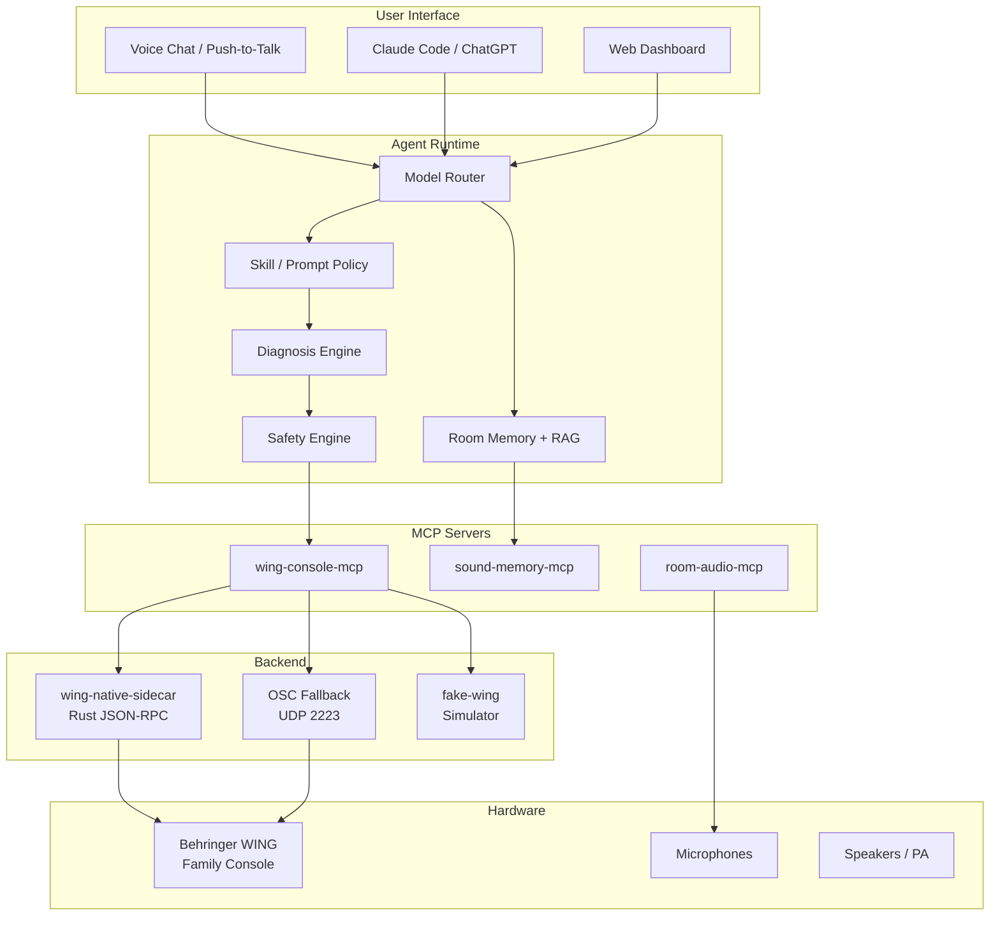

# Architecture Overview

## System Diagram



## Component Descriptions

### wing-console-mcp
The core MCP server. All WING control flows through this component. It exposes 60+ tools organized by domain (device, channels, routing, EQ, FX, etc.). Internal architecture:

```
server.ts                  MCP registration, transport, auth
tools/                     12 tool modules
drivers/WingDriver.ts      Driver interface + FakeWingDriver
safety/                    5 safety modules
state/                     Cache, alias resolver, unit converter
```

### Safety Engine
All writes pass through the safety pipeline:

```
1. RiskEngine.classify(tool, target)       → Risk level
2. PolicyEngine.decide(changeRequest)      → Allow/deny + confirmation requirements
3. ConfirmationManager.createTicket()      → Generate confirmation ticket (5min TTL)
4. [User confirms]
5. ConfirmationManager.validateTicket()    → Verify ticket validity
6. Driver.setParam()                       → Execute the write
7. Driver.getParam()                       → Readback verification
8. AuditLogger.log()                       → Persist audit record
```

### Multi-Level Views
AI agents need different levels of detail for different tasks:

| Level | Tool | Use Case |
|-------|------|----------|
| 0 - Quick | `wing_quick_check` | "Any problems?" in 50ms |
| 1 - Summary | `wing_state_summary` | "What's happening?" overview |
| 2 - Detailed | `wing_channel_strip` | Deep-dive one channel |
| 3 - Comprehensive | `wing_state_snapshot` | Full state dump |
| 4 - Diagnostic | `wing_signal_path_trace` | Signal flow debugging |

### Data Flow

#### Read Flow
```
Agent → MCP tool handler → WingDriver.getParam() → Native/OSC/Fake → WING
                                        ↓
                                 StateCache (5s TTL)
                                        ↓
                              ToolResult { ok, data, human_summary }
```

#### Write Flow
```
Agent → Prepare tool → ChangePlanner.prepareWrite()
                            ↓
                    Read old value → Classify risk → Policy check
                            ↓
                    Confirmation ticket (if needed)
                            ↓
Agent confirms → Apply tool → ChangePlanner.applyWrite()
                            ↓
                    Validate ticket → Re-check policy → Apply change
                            ↓
                    Readback → Compare → Audit → Return result
```

### Protocol Layering

```
MCP JSON-RPC (stdio / HTTP)
    ↓
ChangePlanner (prepare/apply coordination)
    ↓
PolicyEngine (mode + risk policy)
    ↓
WingDriver interface
    ├── NativeDriver (TCP, libwing)
    ├── OscDriver (UDP 2223)
    ├── WapiDriver (HTTP REST, optional)
    └── FakeWingDriver (in-memory, testing)
```

## Safety Design

### Absolute Denials (enforced by server, not by prompt)
1. Raw protocol commands in live mode
2. Critical actions without exact confirmation text
3. Expired confirmation IDs
4. Target mismatch between prepare and apply
5. Material state change between prepare and apply
6. Network settings write unless explicitly enabled
7. Scene recall during active unresolved diagnosis

### Delta Caps
| Parameter | Max Delta | Mode |
|-----------|-----------|------|
| Channel fader | 3 dB | rehearsal |
| Send level | 6 dB | rehearsal |
| Main fader | 1.5 dB | rehearsal |
| EQ gain | 3 dB | rehearsal |
| Gate threshold | 6 dB | rehearsal |

### Confirmation Requirements by Risk
| Risk | Confirmation Text |
|------|-------------------|
| medium | "确认执行" |
| high | "确认执行 {target} {action}" |
| critical | "确认执行 {target} {action}，我知道 {risk_consequence}" |

## Storage Architecture

```
Development:
  SQLite → metadata, audit, incidents
  JSON files → memory records
  Markdown → room docs, patch sheets

Production:
  PostgreSQL + pgvector → memory + RAG
  Object storage → docs
  Append-only audit log
  Encrypted secrets at rest
```
